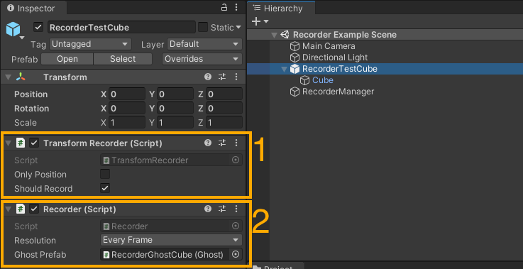
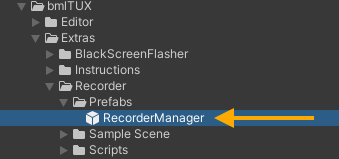
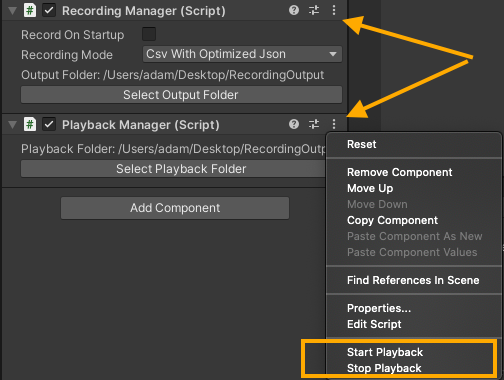

bmlTUX now has the ability to record and playback continuous data. 

There is a sample scene to learn from located in Packages/bmlTUX/Extras/Recorder

# Mental Map

During recording, the `RecorderManager` polls the scene and looks for any `Recorder` components in the scene. It stores the data to a file. 
During playback, the `PlaybackManager` reads a data file and spawns the ghost prefabs for each `Recorder` that was recorded. It then animates the ghosts to playback the scene

The only built-in functionality is to record transforms via the `TransformRecorder` component, but you can extend your own classes to track your own components and data as well.

You can record in several different formats that balance storage size vs. human readability vs. being able to playback recordings. See below for more information.

# Basic workflow

### Setup recorders



* Attach a `TransformRecorder` (or your own custom recorder) component to the object you want to track (1 in above image). This tells the recording system what data needs to be tracked.
* It will automatically also add a `Recorder` component (2 in above image), which handles the actual recording of the tracked data
* Pick the resolution of the recording. Recordings are VERY data consuming, so choosing lower resolution will save dramatically on hard drive and RAM usage. 
* You can temporarily disable recording the component with the `shouldRecord` checkbox.
* Drag a prefab that will act as a Ghost during playback.

### Setup Recorder Manager



* Drag the `RecorderManager` prefab into the scene from the bmlTUX Extras folder
* Set up the recording mode (see below)
* Select output destination

### Setup Playback

* Point to a folder containing recorded data, as long as your ghosts were set up properly, and haven't changed since the recording, you can playback the scene. 
* Note that certain recording formats can't be played back.

# Controls

You can manually record/stop and playback/stop, using the context menus on the `RecordingManager`/`PlaybackManager` components.



You can also control the functions from your scripts through a static API:

```c#
RecordingManager.StartRecording(string recordingFolderPath);

RecordingManager.StopRecording();

PlayBackManager.StartPlayback(string playbackFolderPath);

PlayBackManager.StopPlayback();
```

# Options

### RecorderManager

* Record on startup: Starts recording when program is first started, stops when quits. This wastes a lot of space.
* Recording mode: This selects what format to record in:
  * Optimized JSON for Playback: This is the best option if you only want to playback. The JSON file is not human readable, but greatly saves on resources. This is not suitable for data analysis, unless you are really good at parsing JSON.
  * Huge Readable JSON for playback: Mostly for debugging. Takes up way more space compared to above, and is still not suitable for data analysis. I used this when I was creating custom recording components to make sure all data was properly being recorded and playback-able.
  * CSV with optimized JSON: This allows for both playback and data analysis.
  * CSV Only: data analysis compatible, but cannot playback. This saves resources that are only needed for enabling playback.

### Recorder

* Resolution: Chooses how often to save data. Choosing a low resolution leads to dramatically smaller file sizes and lower RAM consumption. Choose as low as possible.
* GhostPrefab: Required for playback. This is what gets spawned during playback to show what happens. For transforms a simple GameObject with the same mesh as the recorded component mesh usually suffices. See below for more information about Ghosts.

### TransformRecorder

* OnlyPosition: This disables recording of Rotation and Scale, dramatically reducing the file size and RAM consumption.
* ShouldRecord: Can temporarily disable recording of this component. Useful for debugging.


# Playback Ghosts

During playback, "Ghost" prefabs are spawned to represent the recorded components. You create the ghosts yourself. 

For example, if I am trying to visualize the user's head position in a VR experiment. I might record the HMD's (Head-Mounted Display) transform component. For the ghost, I might use a GameObject Prefab with a mesh inside representing the HMD, so that during playback I can visually see where the HMD is in the scene.

# Extending to record your own components:

Say you want to record your own component called `MyCustomMonoBehaviour`.

You need to create 3 scripts.

* A snapshot class inheriting from `Snapshot<MyCustomMonoBehaviour>`. This is the data that gets recorded/played back each frame. let's call this class `MyCustomMonoBehaviourSnapshot`
* A recorder component inheriting from `RecordableComponent<MyCustomMonoBehaviourSnapshot>`. This is what collects the data from your component and saves it to a snapshot when required
* A ghost component inheriting from `GhostComponent<MyCustomMonoBehaviourSnapshot>`. This takes data from a snapshot and applies it back to your custom component during playback.


