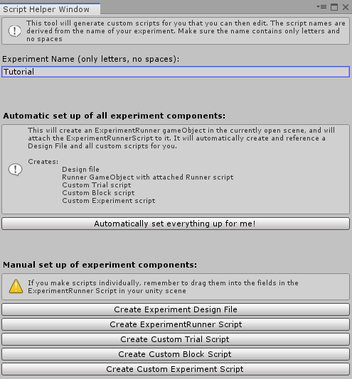

## New Unity Project

1. Create a new Unity Project and adjust the following settings:
    1. Go to Edit > Project Settings > Player:
    2. Change the Api Compatibility Level to .Net 4.0
2. Install TextmeshPro package:
    1. Due to a bug in textmeshpro's earlier versions. bmlTux requires minimum version 2.1.0. At the time of writing, this was still in preview.
    2. Open Window > Package Manager. Select "All packages" from the dropdown
    3. Find TextMeshPro and install it. If you don't see 2.1.0 or later, you will need to enable preview packages in the "Advanced dropdown"
    4. A popup will appear after import asking to import essentials. Do this.


## Install bmlTUX
1. Go to the releases page https://github.com/BioMotionLab/TUX/releases. Don't download anything, just note the number of the most recent release. It Should be in the format X.Y.Z, for example 1.0.1.
2. In a new unity project (Unity 2019.3 or later), open the Package Manager from the Window menu.
3. Back in unity, click the plus button at the top of the window, selecting "Add package from git URL"
4. Type in the following url, replacing X.Y.Z with the correct number noted above. and press "Add". 

```text
https://github.com/BioMotionLab/TUX.git#X.Y.Z
```

At first you may notice nothing happens. The Unity Package Manager provides little feedback, but behind the scenes, it should be downloading and importing. Eventually, you should see a loading bar appear.

When finished, in the Project window, expand the Packages folder, and you should see a folder called bmlTUX. You should also notice a new menu at the top of the screen.

You're all set.

## Set up the Unity Scene
1. Create a new Unity Scene and name it TutorialExperiment
2. Open the "Script Helper Tool" from the "bmlTUX" menu.
3. Name your Experiment "Tutorial"
4. Click "Automatically set everything up for me". The toolkit will create a bunch of files in your Assets folder and an empty GameObject in your unity scene with an ExperimentRunner script attached to it. This object is the main window of communication between the toolkit and your unity scene.



## Looking at the Experiment Runner script for your experiment
1. Double click on the created `TutorialExperimentRunner.cs` C# file that was created in your Assets folder.
2. The file will load in your editor and you can see that it should already be populated with some code for the most basic experiment.
3. The script is a class called `TutorialExperimentRunner`, and it inherits from `ExperimentRunner` class.
   
Your file should look like this (there might also be some comments in it):

```csharp
using bmlTUX.Scripts.ExperimentParts;

public class TutorialExperimentRunner : ExperimentRunner
{

}
```

4. Click on the TutorialExperimentRunner `GameObject` that was created in the unity scene. Notice the TutorialExperimentRunner script was automatically attached to it. This is where we'll reference objects in our Unity Scene that we need to manipulate.
