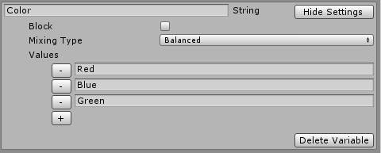

When we used the Script Helper Tool, it also created a Design File called `TutorialDesignFile.asset`. This is the file used to set up our experimental design.

The design file provides a simple interface that access a powerful behind-the-scenes system for setting up your experimental design without having to write any code. 

1. Click once on the created design file in the Assets folder to look at its inspector. 
2. You'll see several options. For more detail on what these settings do please see the main [documentation](Home). 

## Variables

1. Notice that there are sections for different types of variables. Briefly:
    1. **Independent variables:** any manipulated variables that change between trials or blocks in your experiment (e.g. which stimuli, presentation time, distance from participant etc.)
    2. **Dependent variables:** outputs or measurements from your experiment (i.e. response time, selection etc.)
    3. **Participant variables:** Collected at the start of the session from each participant (e.g. gender, ID, etc.)
    
    
### Independent Variables
    
Let’s set up our experiment’s variables. 

#### Color

We want to vary the color of our stimulus in each trial. So let’s define an independent variable named Color.

1. In the Design file’s inspector, in the Variable Creation section, under type to create, choose “String” to make a text-based variable.
2. Select Independent.
3. Click Create Variable.
4. You should see a new variable appear in the Independent Variables section.
5. Name it "Color"
6. We want an the trials to be created for every possible color, so choose Balanced for the mixing type.
7. Define values for our variable. Click the plus button to add values.
    1. Add values: Red, Blue, Green.
8. You should see something like this:
 

#### Size

Next, Let’s create our size variable. 

1. Create a float independent variable
2. Name it "Size".
3. Choose "balanced" mixing mode.
4. Add values 1, 2, 3.

### Participant Variables

We also want to record each participant's gender and age at the start of each experimental session.

Create a string participant variable named Gender
1. Check Constrain values. This ensures that the value is restricted to a set of values that we define.
2. Type in Male, Female, Other

Create an int Participant variable named Age.
1. Keep Constrain values unchecked so we can type in their age.

### Dependent Variables

We want to record how closely the participants match the size of the stimulus. We’ll record that in a float dependent variable called MatchedSize. The default value will be assigned to any missing values in case of problems or stopping the experiment early.
 
## Test out our experiment design using basic components

The Script Helper tool defined enough of the experiment to let you get up and started quickly. Lets test out if everything is working as expected before moving forward.

Press play in the editor. You’ll see a window to start an experimental session. Unity may prompt you to install TextMeshPro assets. You should accept this since the Runner Interface depends on them.

**_Important Note: The Runner interface is meant to be displayed on a secondary monitor so that the experimenter can monitor and setup the experiment without the participant seeing it. To view both at the same time, make sure you have a second "Game" tab open set to "Display 2". The main experiment will be shown on Display 1, with the interface showing on Display 2. This can be adjusted in the settings._**

**_Important Note for VR Users: SteamVR can sometimes take over the display of Display 1. You may need to display the Runner UI on display 2, even with only one monitor.

1. Take a look at the previewed trial table and ensure everything is set up properly. Note that the toolkit adds some useful columns to track progress and other metrics.
2. Debug mode is useful to check functionality during development without having to type in complicated options. Click Debug.
3. Because it’s debug mode it automatically chooses values for our participant variables and other things. A normal run through the program will force you to select a value. 
4. Once started, the toolkit automatically constructs your blocks and trials based on code that you provide the ExperimentRunner class. At the moment, we haven't provided any, so it reverts to the built-in defaults.
5. A new window will appear showing the progress through the experiment.
6. In the default scripts, a trial is simply defined as pressing the return key. Press it a few times to see how the trials advance, and the values of the independent variables change.  

_Note: Make sure you have one of the "Game" windows focused for the key presses to register_
 
It looks like everything is working properly. Although the auto-generated scripts have enough functionality to allow the experiment to run, but they don't _do_ anything to our Unity scene. 

In the next part of the tutorial we'll learn how to extend our auto-generated scripts by defining some custom behaviour in our experiment.