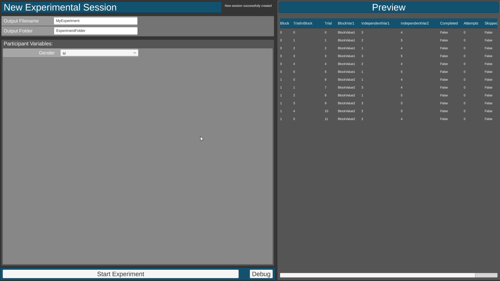

This tutorial will guide you through the basic steps to make a simple experiment using bmlTUX. For this tutorial our experiment will present the participant with a simple stimulus, and then have the participant match the size of another object to the stimulus. We will vary the stimulus’ size, and distance, and the color of the stimulus. We will also collect participants' age and assign them an ID. We want to record how close the participant matched the size, and the time it took them.

The finished project from this tutorial can be found in the toolkit's Samples folder for reference.

_Note: This tutorial, for simplicity, does not teach best coding practices. It is designed to show the basic functionality of the experiment framework, and in some instances purposely uses poor coding practices to increase clarity._

## Requirements
* **Important:** Unity 2019.2 or later required.
* See [Requirements section](Requirements) in main documentation for a more exhaustive list and tips on setting up Unity.
* This tutorial was written for bmlTUX version 0.12.0-beta. Since it is still under heavy development some names/process may be slightly different in newer versions.
* **Highly recommended:** Using [JetBrains Rider IDE](https://www.jetbrains.com/rider/?fromMenu), which is free for academic use.

## Solving Problems You May Encounter
1. Check the [Troubleshooting](Troubleshooting) page.
2. Check syntax and spelling. Many errors are due to this.
3. Compare your code to the completed Tutorial Project located in the "SamplesAndTutorials" folder.
4. If you think you've uncovered a bug or mistake, open a new issue on the [Issues page](https://github.com/BioMotionLab/bmlTux/issues) so we can try to fix it.
