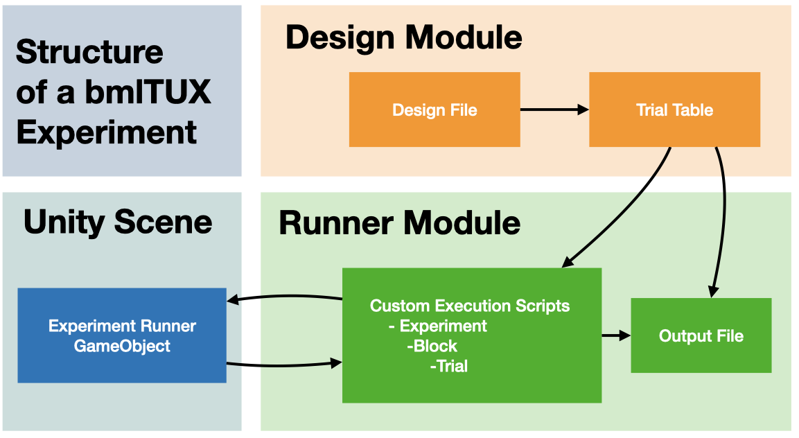

In our approach, we keep the configuration of the structure of the experiment (**Design module**) entirely separate from the execution of the experiment itself (**Runner module**). 

## Design Module

The **Design module** is set of tools aids with setting up the experiment’s variables and their behavior. Using a graphical user interface in a Unity inspector window, experimenters can declare all factors that affect the design of the experiment. At this stage, the user specifies independent, dependent, and participant variables, their levels, and the rules by which they are combined into trials. Independent variables are factors that affect how stimuli are displayed and manipulated. Experimenters can adjust settings for each independent variable to define the rules by which they are combined into trials, the order in which these trials are being presented to the participants, and a few other parameters that control experimental flow. Dependent variables include expected measurements and responses that will be collected from participants during runtime. Participant variables are those that are consistent for each participant in the experiment and do not change over an experimental session (e.g. participant gender).

Once the configuration of the Design module is complete, the toolkit will create a **Trial Table**, which specifies the values of all variables for each particular trial and the order in which the trials should be executed. This trial table is automatically generated based on the configuration of each variable, including any randomization or combinatorics (described below). Each row of the table is one trial, and each column is one variable. Since experimenters typically require some form of randomization or counterbalancing (e.g. randomizing the order of trials), a new Trial Table is typically generated for every participant. This Trial Table is sent by the toolkit to the Runner module for execution. 

## Runner Module

The **Runner module** is responsible for the execution of the experiment. Given a Trial Table, it runs through each row the experiment in the correct order. For each trial, it sends the appropriate values of all independent variables to the Unity scene for stimulus manipulation. After every trial the runner module updates an output file with any new measurements and participant responses. Unlike the Design module, which does not require any coding, the Runner module requires custom scripts to define how the Unity scene should respond to each trial. These custom scripts describe how changes in the values of independent variables contained in the Trial Table should manipulate objects in the Unity scene and drive experimental behavior. These custom scripts can modify behavior at three levels: 

1. The experiment level: Add custom behavior at the start and end of an experiment (e.g. instructions at the start of an experiment).
2. The individual trial level: Add custom behavior that occurs during a trial, and/or the start and end of each trial (e.g. change stimulus, move objects in scene, etc.). This script is required for most experiments.
3. The block-of-trials level: Add custom behavior at the start end each block of trials (e.g. show the same stimulus for an entire block of trials). Blocks of trials are defined in the Design module as special variables (see below).
