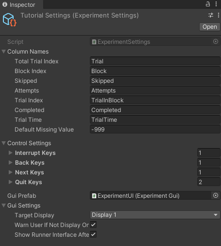

## Experiment Settings

Many settings pertaining to an experiment can be adjusted using the settings file automatically created by the experiment Helper tool.




### Column names

Allows renaming the names of the default columns in the output file and Runner Interface

Default missing value is what shows in the output file if you forget to write to a variable. Very helpful for debugging purposes.

### Control settings:

Controls for the Runner Interface to navigate between trials. This is mostly deprecated, but was used in development of bmlTUX. Might have some edge use cases so I left it in.

### GUI Settings

**Gui Prefab**: You can create your own GUI or modify the existing one to add customization. This tells the program which prefab to use.

**Target Display:** Chose which display to show the Runner Interface (both the experiment start screen and the progress screen).

**Warn User if Not Display One:** This spits out a debug warning if the interface is not set to display one. This is mostly for noobs who haven't found this settings file, to prevent them from filing bug reports when they can't see the GUI. Uncheck this if you know what the above **Target Display** function  is for.

**Show runner interface as start:** Uncheck this if you don't want to use the runner interface, and want to start your experiment manually. Note, you can start an experiment manually by doing this:

```c#
Session session = new Session(); 
// this needs to be a valid session that you create. Will be a bit more complicated if you have participant variables.
ExperimentEvents.StartExperimentFromScript(Session session);
```

**_Important Note for VR Users: SteamVR can sometimes take over the display of Display 1. You may need to display the Runner UI on display 2, even with only one monitor working in the editor._**


### Advanced Settings

See the [Advanced Settings Page](Advanced-options.md)


